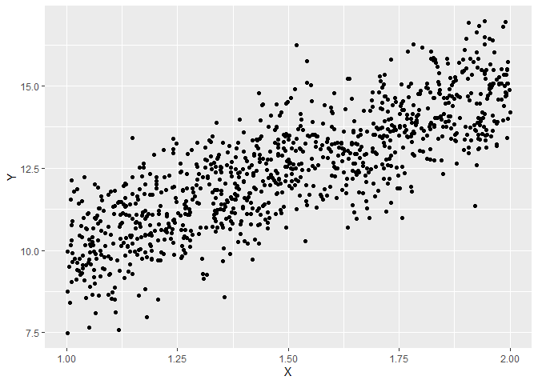

<!-- README.md is generated from README.Rmd. Please edit that file -->

# GlmSimulatoR

<!-- badges: start -->

[](https://cran.r-project.org/package=GlmSimulatoR)
[](https://github.com/gmcmacran/GlmSimulatoR/actions)
[](https://codecov.io/gh/gmcmacran/GlmSimulatoR?branch=master)
<!-- badges: end -->

Often the first problem in understanding statistical models is finding
good data. This package alleviates this by creating data perfect for
generalized linear models. With data in hand, you can focus on questions
about models instead of questions about data. Are the estimated weights
close to the true values? Does step wise search pick the correct
variables? At what n does the sampling distribution of weights
normalize?

## Package Overview

All functions return a tibble. The only thing that changes is the
distribution of Y. In simulate\_gaussian, Y follows a Gaussian
distribution. In simulate\_gamma, Y follows a gamma distribution. Common
and novel distributions are implemented. For each distribution, all
links are implemented.

## What does a scatter plot of ideal data for the linear model look like?

To answer this question, a simulated data is made.

``` r
library(GlmSimulatoR)
library(ggplot2)

set.seed(1)
simdata <- simulate_gaussian(N = 1000, weights = 5, xrange = 1, ancillary = 1) #GlmSimulatoR function
simdata %>% 
  print()
#> # A tibble: 1,000 x 2
#>        Y    X1
#>    <dbl> <dbl>
#>  1 11.4   1.27
#>  2 11.6   1.37
#>  3 11.7   1.57
#>  4 14.6   1.91
#>  5 12.0   1.20
#>  6 16.1   1.90
#>  7 13.4   1.94
#>  8 13.1   1.66
#>  9 14.3   1.63
#> 10  9.19  1.06
#> # ... with 990 more rows
```

What does Y look like for ideal data? Lets see.

``` r
ggplot(simdata, aes(x = Y)) + 
  geom_histogram(bins = 30) + 
  labs(x = "Y", y = "")
```


Y resembles a Gaussian distribution. What does the relationship between
Y and X look like?

``` r
ggplot(simdata, aes(x = X1, y = Y)) + 
  geom_point() + 
  labs(x = "X")
```



See vignettes for more examples.
