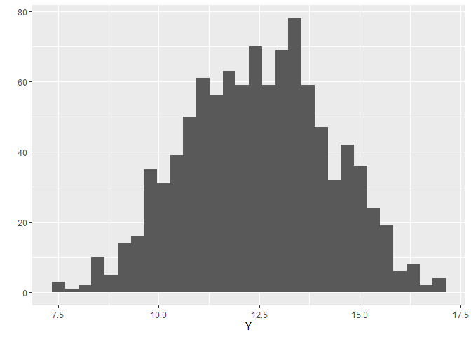

<!-- README.md is generated from README.Rmd. Please edit that file -->

# GlmSimulatoR

<!-- badges: start -->

[](https://cran.r-project.org/package=GlmSimulatoR)
[](https://github.com/gmcmacran/GlmSimulatoR/actions)
[](https://codecov.io/gh/gmcmacran/GlmSimulatoR?branch=master)
<!-- badges: end -->

Often the first problem in understanding statistical models is finding
good data. This package alleviates this by enabling you to create the
data you need. With data in hand, you can answer questions. Is the
estimated weight close to the true value? Does step wise search pick the
correct variables? At what n does the sampling distribution normalize?

## What does ideal data for the linear model look like?

To answer this question, a simulated data set where Y follows a normal
distribution is made.

``` r
library(GlmSimulatoR)
library(ggplot2)

set.seed(1)
simdata <- simulate_gaussian(N = 100, weights = 2, xrange = 10, ancillary = 1) #GlmSimulatoR function
simdata %>% 
  print()
#> # A tibble: 100 x 2
#>        Y    X1
#>    <dbl> <dbl>
#>  1  9.71  3.66
#>  2 10.8   4.72
#>  3 15.8   6.73
#>  4 21.0  10.1 
#>  5  9.47  3.02
#>  6 23.9   9.98
#>  7 22.5  10.4 
#>  8 16.2   7.61
#>  9 17.2   7.29
#> 10  5.10  1.62
#> # ... with 90 more rows
```

Then the data set is visualized.

``` r
ggplot(simdata, aes(x = X1, y = Y)) + 
  geom_point()
```



Voila The answer is found. See vignettes for more examples.
